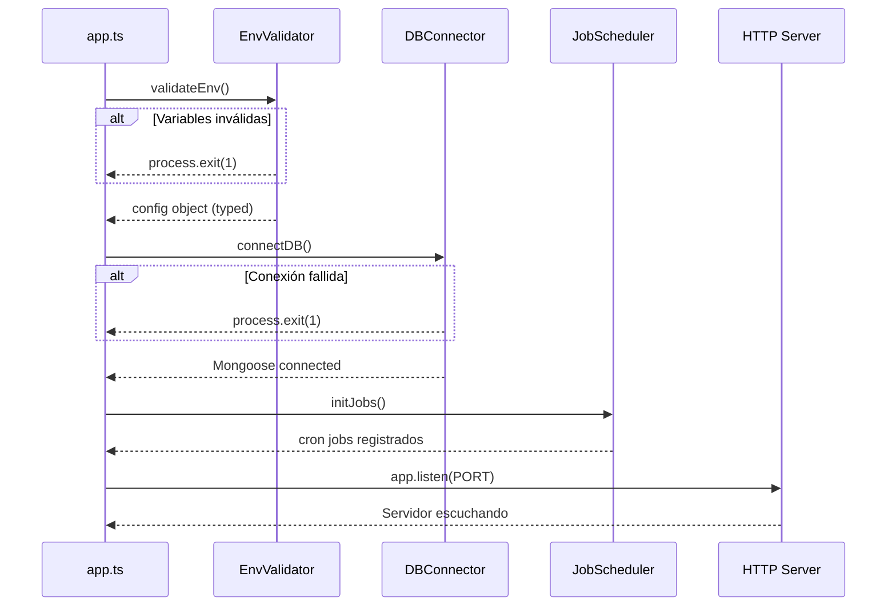

# Design Document

## Overview

Este documento describe el diseño técnico de un backend REST API construido con **Node.js 20+**, **TypeScript** y **Express.js**. El sistema está pensado como una base de producción reutilizable que incluye autenticación JWT, conexión a MongoDB Atlas, validación de datos con Zod, seguridad HTTP reforzada, envío de emails, generación de archivos Excel y ejecución de jobs programados con node-cron.

El objetivo principal es establecer una arquitectura limpia, tipada y extensible sobre la que se puedan construir funcionalidades de negocio sin deuda técnica desde el primer día.

### Tecnologías principales

| Categoría | Librería |
|---|---|
| Runtime | Node.js 20+ |
| Lenguaje | TypeScript 5.x |
| Framework HTTP | Express.js 4.x |
| Base de datos | MongoDB Atlas + Mongoose |
| Autenticación | jsonwebtoken |
| Validación | Zod |
| Seguridad | helmet, cors, express-rate-limit, bcryptjs |
| Email | nodemailer |
| Excel | exceljs |
| Jobs | node-cron |
| Dev | nodemon, ts-node |
| Variables de entorno | dotenv |

---

## Architecture

La arquitectura sigue un patrón **Layered Architecture** (capas) con separación clara de responsabilidades:

```
HTTP Request
     │
     ▼
┌─────────────────────────────────────────┐
│           Express Middleware Stack       │
│  helmet → cors → json → rateLimiter     │
└─────────────────────────────────────────┘
     │
     ▼
┌─────────────────────────────────────────┐
│              Router Layer               │
│   /health, /api/v1/...                  │
└─────────────────────────────────────────┘
     │
     ▼
┌─────────────────────────────────────────┐
│           Middleware Layer              │
│   authMiddleware, validateBody(schema)  │
└─────────────────────────────────────────┘
     │
     ▼
┌─────────────────────────────────────────┐
│           Controller Layer              │
│   Orquesta request/response             │
└─────────────────────────────────────────┘
     │
     ▼
┌─────────────────────────────────────────┐
│            Service Layer                │
│   Lógica de negocio pura                │
└─────────────────────────────────────────┘
     │
     ▼
┌─────────────────────────────────────────┐
│             Model Layer                 │
│   Mongoose schemas y modelos            │
└─────────────────────────────────────────┘
     │
     ▼
  MongoDB Atlas
```

### Flujo de arranque



---

## Components and Interfaces

### 1. EnvValidator (`src/config/env.ts`)

Responsable de validar y exportar la configuración tipada del entorno.

```typescript
// Interfaz exportada
interface AppConfig {
  PORT: number;
  MONGODB_URI: string;
  JWT_SECRET: string;
  JWT_EXPIRES_IN: string;
  NODE_ENV: 'development' | 'production' | 'test';
  MAIL_HOST: string;
  MAIL_PORT: number;
  MAIL_USER: string;
  MAIL_PASS: string;
  MAIL_FROM: string;
  ANTHROPIC_API_KEY: string;
}

export function validateEnv(): AppConfig;
export const config: AppConfig;
```

**Decisión de diseño**: Se usa `z.coerce.number()` para `PORT` y `MAIL_PORT` para convertir automáticamente los strings de `.env` a números. Si la validación falla, se imprime cada error de Zod y se llama a `process.exit(1)` antes de que cualquier otro módulo se inicialice.

### 2. DBConnector (`src/config/db.ts`)

```typescript
export async function connectDB(): Promise<void>;
```

Llama a `mongoose.connect(config.MONGODB_URI)`. En caso de éxito, loguea el hostname. En caso de error, loguea el mensaje y llama a `process.exit(1)`.

### 3. Express App (`src/app.ts`)

Configura el stack de middlewares globales y registra los routers. No llama a `app.listen()` — eso lo hace `src/server.ts` para facilitar el testing.

```typescript
// src/app.ts
const app = express();
app.use(helmet());
app.use(cors(corsOptions));
app.use(express.json());
app.use(rateLimiter);
app.use('/health', healthRouter);
app.use('/api/v1', apiRouter);
export default app;

// src/server.ts  (punto de entrada)
async function main() {
  const cfg = validateEnv();
  await connectDB();
  initJobs();
  app.listen(cfg.PORT, () => console.log(`Server on port ${cfg.PORT}`));
}
main();
```

### 4. AuthMiddleware (`src/middlewares/auth.middleware.ts`)

```typescript
export function authMiddleware(
  req: Request,
  res: Response,
  next: NextFunction
): void;
```

- Extrae el token del header `Authorization: Bearer <token>`.
- Verifica con `jwt.verify(token, config.JWT_SECRET)`.
- Adjunta el payload decodificado a `req.user`.
- Responde 401 si el header está ausente, el token es inválido o está expirado.

**Extensión de tipos**:
```typescript
// src/types/express.d.ts
declare global {
  namespace Express {
    interface Request {
      user?: JwtPayload;
    }
  }
}
```

### 5. Validation Middleware Factory (`src/middlewares/validate.middleware.ts`)

```typescript
export function validateBody<T>(schema: ZodSchema<T>): RequestHandler;
```

Retorna un middleware que llama a `schema.safeParse(req.body)`. Si falla, responde 400 con un array de errores `{ field: string; message: string }[]`. Si pasa, llama a `next()`.

### 6. RateLimiter (`src/middlewares/rateLimiter.ts`)

```typescript
export const rateLimiter: RequestHandler;
```

Configurado con `express-rate-limit`: `windowMs: 15 * 60 * 1000`, `max: 100`, mensaje de error descriptivo en JSON.

### 7. MailService (`src/utils/mail.util.ts`)

```typescript
interface MailOptions {
  to: string;
  subject: string;
  html: string;
  text?: string;
}

export async function sendMail(options: MailOptions): Promise<void>;
```

Crea un transporter de Nodemailer con las variables `MAIL_*`. Si el envío falla, lanza un `Error` que incluye el mensaje SMTP original.

### 8. ExcelService (`src/utils/excel.util.ts`)

```typescript
interface ColumnDefinition {
  header: string;
  key: string;
  width?: number;
}

export async function generateExcel(
  sheetName: string,
  columns: ColumnDefinition[],
  rows: Record<string, unknown>[]
): Promise<Buffer>;
```

Usa `ExcelJS.Workbook`. Crea el workbook, añade la hoja, define columnas, añade filas y retorna el buffer con `workbook.xlsx.writeBuffer()`. Si `rows` está vacío, retorna un buffer con solo la fila de cabeceras.

### 9. JobScheduler (`src/jobs/index.ts`)

```typescript
interface JobDefinition {
  name: string;
  schedule: string; // cron expression
  handler: () => Promise<void> | void;
}

export function initJobs(): void;
```

Itera sobre las definiciones de jobs, registra cada uno con `cron.schedule()`. El wrapper de cada job loguea nombre y timestamp al inicio, y captura errores para logearlos sin detener el scheduler.

### 10. HealthEndpoint (`src/routes/health.route.ts`)

```typescript
// GET /health → 200 { status: "ok", timestamp: string, uptime: number }
```

No requiere autenticación. Responde con `status: "ok"` y metadatos opcionales de diagnóstico.

### 11. Permissions (`src/config/permissions.ts`)

```typescript
export enum Role {
  ADMIN = 'admin',
  USER = 'user',
}

export const PERMISSIONS: Record<Role, string[]> = {
  [Role.ADMIN]: ['*'],
  [Role.USER]: ['read:own'],
};
```

Centraliza las definiciones de roles y permisos para RBAC.

---

## Data Models

### Estructura de directorios

```
src/
├── config/
│   ├── env.ts          # EnvValidator
│   ├── db.ts           # DBConnector
│   └── permissions.ts  # RBAC definitions
├── models/             # Mongoose schemas
├── routes/
│   ├── health.route.ts
│   └── index.ts        # API router aggregator
├── controllers/        # Request/response handlers
├── services/           # Business logic
├── middlewares/
│   ├── auth.middleware.ts
│   ├── validate.middleware.ts
│   └── rateLimiter.ts
├── validators/         # Zod schemas
├── jobs/
│   └── index.ts        # JobScheduler
├── utils/
│   ├── mail.util.ts
│   └── excel.util.ts
├── types/
│   └── express.d.ts    # Request augmentation
├── app.ts              # Express app setup
└── server.ts           # Entry point
```

### Modelo de configuración de entorno (Zod Schema)

```typescript
const envSchema = z.object({
  PORT: z.coerce.number().default(3000),
  MONGODB_URI: z.string().url(),
  JWT_SECRET: z.string().min(32),
  JWT_EXPIRES_IN: z.string().default('7d'),
  NODE_ENV: z.enum(['development', 'production', 'test']).default('development'),
  MAIL_HOST: z.string(),
  MAIL_PORT: z.coerce.number(),
  MAIL_USER: z.string(),
  MAIL_PASS: z.string(),
  MAIL_FROM: z.string().email(),
  ANTHROPIC_API_KEY: z.string().min(1),
});
```

### Modelo de respuesta de error estándar

Todas las respuestas de error siguen esta estructura:

```typescript
interface ErrorResponse {
  success: false;
  message: string;
  errors?: { field: string; message: string }[]; // solo en errores de validación
}
```

### Modelo de respuesta exitosa estándar

```typescript
interface SuccessResponse<T> {
  success: true;
  data: T;
  message?: string;
}
```

### Payload JWT

```typescript
interface JwtPayload {
  sub: string;      // user ID
  email: string;
  role: string;
  iat?: number;
  exp?: number;
}
```

---

## Correctness Properties

*A property is a characteristic or behavior that should hold true across all valid executions of a system — essentially, a formal statement about what the system should do. Properties serve as the bridge between human-readable specifications and machine-verifiable correctness guarantees.*

### Property 1: Validación de entorno rechaza configuraciones inválidas

*For any* conjunto de variables de entorno donde una o más variables requeridas están ausentes o tienen un tipo incorrecto, el EnvValidator SHALL lanzar un error de validación (y no exportar un objeto de configuración válido).

**Validates: Requirements 1.1, 1.2**

### Property 2: Coerción de tipos numéricos en variables de entorno

*For any* valor de `PORT` o `MAIL_PORT` que sea un string representando un número entero positivo, el EnvValidator SHALL producir un objeto de configuración donde dichos campos son de tipo `number`.

**Validates: Requirements 1.5, 1.6**

### Property 3: Validación de body rechaza payloads inválidos

*For any* Zod schema y cualquier objeto `req.body` que no conforme con ese schema, el validation middleware SHALL responder con HTTP 400 y un array de errores que contenga al menos un elemento con `field` y `message`.

**Validates: Requirements 6.1, 6.2, 6.3**

### Property 4: Validación de body acepta payloads válidos

*For any* Zod schema y cualquier objeto `req.body` que conforme con ese schema, el validation middleware SHALL llamar a `next()` sin modificar la respuesta.

**Validates: Requirements 6.1, 6.2**

### Property 5: AuthMiddleware rechaza tokens inválidos

*For any* request con un token JWT que tenga una firma inválida o esté expirado, el AuthMiddleware SHALL responder con HTTP 401.

**Validates: Requirements 5.3, 5.4**

### Property 6: AuthMiddleware acepta tokens válidos

*For any* JWT firmado con `JWT_SECRET` que no esté expirado, el AuthMiddleware SHALL decodificar el payload y adjuntarlo a `req.user`, y llamar a `next()`.

**Validates: Requirements 5.1, 5.2**

### Property 7: ExcelService genera buffer válido para cualquier conjunto de filas

*For any* nombre de hoja, definición de columnas y array de filas (incluyendo el array vacío), la función `generateExcel` SHALL retornar un `Buffer` no vacío que represente un archivo `.xlsx` válido con las cabeceras definidas.

**Validates: Requirements 8.2, 8.3**

### Property 8: RateLimiter bloquea tras superar el límite

*For any* IP que realice más de 100 requests dentro de una ventana de 15 minutos, el RateLimiter SHALL responder con HTTP 429 a partir de la petición número 101.

**Validates: Requirements 3.4, 3.5**

---

## Error Handling

### Estrategia global

Se implementa un **error handler centralizado** como último middleware de Express:

```typescript
// src/middlewares/errorHandler.middleware.ts
export function errorHandler(
  err: Error,
  req: Request,
  res: Response,
  next: NextFunction
): void {
  const status = (err as any).statusCode ?? 500;
  res.status(status).json({
    success: false,
    message: err.message ?? 'Internal Server Error',
  });
}
```

### Tabla de errores por componente

| Componente | Condición de error | Comportamiento |
|---|---|---|
| EnvValidator | Variable faltante o inválida | Log + `process.exit(1)` |
| DBConnector | Fallo de conexión Mongoose | Log + `process.exit(1)` |
| AuthMiddleware | Header ausente | HTTP 401 + mensaje |
| AuthMiddleware | Token inválido/expirado | HTTP 401 + mensaje |
| ValidateMiddleware | Body no conforme al schema | HTTP 400 + array de errores |
| RateLimiter | Límite superado | HTTP 429 + mensaje |
| MailService | Fallo SMTP | Lanza `Error` con mensaje SMTP |
| JobScheduler | Error en handler de job | Log + continúa scheduling |
| ErrorHandler global | Cualquier error no capturado | HTTP 500 + mensaje genérico |

### Errores de arranque vs. errores de runtime

- **Arranque** (EnvValidator, DBConnector): fallos fatales → `process.exit(1)`. El servidor nunca debe arrancar en estado inválido.
- **Runtime** (middlewares, servicios): errores manejados → respuestas HTTP apropiadas o propagación al error handler global.

---

## Testing Strategy

### Enfoque dual: Unit Tests + Property-Based Tests

Se utiliza **Vitest** como test runner (compatible con TypeScript sin configuración adicional) y **fast-check** como librería de property-based testing.

```bash
# Instalación de dependencias de test
npm install -D vitest @vitest/coverage-v8 fast-check supertest @types/supertest
```

### Unit Tests

Los unit tests cubren comportamientos específicos y casos de borde:

- **EnvValidator**: variables presentes/ausentes, coerción de tipos, valores por defecto.
- **AuthMiddleware**: header ausente, token expirado, token con firma incorrecta, token válido.
- **ValidateMiddleware**: body válido llama `next()`, body inválido retorna 400 con errores.
- **MailService**: mock del transporter, verificación de parámetros, manejo de error SMTP.
- **ExcelService**: buffer no vacío, cabeceras presentes, filas vacías generan solo cabeceras.
- **JobScheduler**: jobs se registran, errores en handlers son capturados.
- **HealthEndpoint**: responde 200 con `{ status: "ok" }`.

### Property-Based Tests

Cada propiedad del documento se implementa con un único test de fast-check con mínimo **100 iteraciones**:

```typescript
// Ejemplo: Property 3 - Validación de body rechaza payloads inválidos
import { fc } from 'fast-check';

// Feature: nodejs-express-backend, Property 3: validation middleware rejects invalid payloads
test('validateBody rechaza cualquier body que no conforme al schema', () => {
  fc.assert(
    fc.property(
      fc.record({ name: fc.integer() }), // body inválido (name debe ser string)
      (invalidBody) => {
        const result = userSchema.safeParse(invalidBody);
        expect(result.success).toBe(false);
        if (!result.success) {
          expect(result.error.errors.length).toBeGreaterThan(0);
        }
      }
    ),
    { numRuns: 100 }
  );
});
```

### Configuración de Vitest

```typescript
// vitest.config.ts
import { defineConfig } from 'vitest/config';

export default defineConfig({
  test: {
    globals: true,
    environment: 'node',
    coverage: {
      provider: 'v8',
      reporter: ['text', 'lcov'],
    },
  },
});
```

### Scripts de test en package.json

```json
{
  "scripts": {
    "test": "vitest --run",
    "test:watch": "vitest",
    "test:coverage": "vitest --run --coverage"
  }
}
```

### Organización de tests

```
src/
└── __tests__/
    ├── unit/
    │   ├── env.test.ts
    │   ├── auth.middleware.test.ts
    │   ├── validate.middleware.test.ts
    │   ├── mail.util.test.ts
    │   ├── excel.util.test.ts
    │   └── jobs.test.ts
    ├── property/
    │   ├── env.property.test.ts
    │   ├── validate.property.test.ts
    │   ├── auth.property.test.ts
    │   ├── excel.property.test.ts
    │   └── rateLimiter.property.test.ts
    └── integration/
        └── health.test.ts
```

### Cobertura objetivo

| Módulo | Tipo de test | Cobertura objetivo |
|---|---|---|
| EnvValidator | Unit + Property | 95% |
| AuthMiddleware | Unit + Property | 90% |
| ValidateMiddleware | Unit + Property | 90% |
| MailService | Unit (mock) | 85% |
| ExcelService | Unit + Property | 90% |
| JobScheduler | Unit | 85% |
| HealthEndpoint | Integration | 100% |
